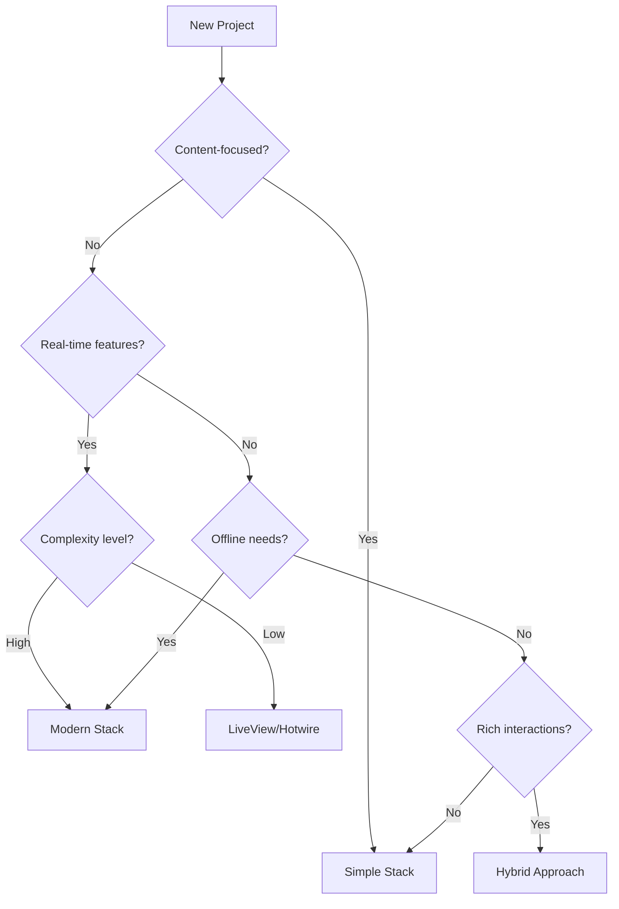

# Chapter 8.5: The Simple vs Modern Web Dilemma
## *Or: Why Your 2024 React App Feels Slower Than a 2004 PHP Site*

> "We've successfully made the web slower with 100x faster hardware." - Every Honest Web Developer

## Table of Contents
- [The Performance Paradox](#the-performance-paradox)
- [Anatomy of Modern Web Bloat](#anatomy-of-modern-web-bloat)
- [The Simple Stack Renaissance](#the-simple-stack-renaissance)
- [Performance Comparison: Real Numbers](#performance-comparison-real-numbers)
- [When to Choose Simple](#when-to-choose-simple)
- [When to Choose Modern](#when-to-choose-modern)
- [The Hybrid Approach](#the-hybrid-approach)
- [Practical Implementation Examples](#practical-implementation-examples)
- [Making the Right Choice](#making-the-right-choice)

---

## The Performance Paradox

Remember when websites loaded instantly? When clicking a link meant seeing content immediately, not watching a spinner while 5MB of JavaScript downloads? Let's have an honest conversation about why modern web apps often feel slower than their predecessors, and what we can do about it.

### The Numbers Don't Lie

**Simple PHP Site (2004)**
- HTML size: 50KB
- Total page weight: 200KB
- Time to interactive: 0.5 seconds
- Server processing: 50ms
- Works without JavaScript

**Modern React App (2024)**
- Initial bundle: 2MB+ 
- Total page weight: 5MB+
- Time to interactive: 3-5 seconds
- Multiple API calls required
- Breaks without JavaScript

### Why This Happened

1. **Developer Experience Over User Experience**: Modern frameworks optimize for developer productivity
2. **Feature Creep**: Every library adds "just 50KB more"
3. **SPA Everything**: Even simple sites became complex applications
4. **Mobile Last**: Many sites still designed desktop-first
5. **Abstraction Layers**: Each layer adds overhead

---

## Anatomy of Modern Web Bloat

Let's dissect what makes modern web apps slow:

### The JavaScript Tax

```javascript
// Modern "Hello World" requires:
- React: 45KB (min+gzip)
- React-DOM: 130KB
- Next.js runtime: 90KB
- Various polyfills: 30KB
- Your actual code: 10KB
Total: 305KB just to show "Hello World"

// Simple approach:
<h1>Hello World</h1>
Total: 11 bytes
```

### The Waterfall of Doom

```
1. Load HTML shell (1 request)
2. Load CSS bundle (1 request)
3. Load JS bundle (1-5 requests)
4. Parse and execute JS
5. Render virtual DOM
6. Make API calls (3-10 requests)
7. Re-render with data
8. Load lazy components
9. Finally interactive
```

### Real Performance Impact

**💥 Failure Story**: The E-commerce Disaster

We rebuilt a perfectly functional PHP e-commerce site in React. Results:
- Page load time: 0.8s → 4.2s
- Bounce rate: 25% → 55%
- Conversion rate: 3.2% → 1.8%
- Revenue: Down 40%

The client asked us to "make it fast like before." We had to add SSR, optimize bundles, implement caching... basically recreating what PHP did automatically.

---

## The Simple Stack Renaissance

### What Makes Simple Stacks Fast

1. **Server-Side Rendering by Default**
   ```php
   <?php
   // Data fetching and rendering in one request
   $users = db_query("SELECT * FROM users");
   foreach ($users as $user) {
       echo "<div>{$user['name']}</div>";
   }
   ?>
   ```

2. **No Build Step**
   - Edit file → Save → Refresh → See changes
   - No webpack, no babel, no waiting

3. **Progressive Enhancement**
   ```html
   <!-- Works without JS -->
   <form action="/search" method="GET">
       <input name="q" type="search">
       <button>Search</button>
   </form>
   
   <!-- Enhance with JS if available -->
   <script>
   if (window.fetch) {
       form.onsubmit = async (e) => {
           e.preventDefault();
           // Add nice UX features
       };
   }
   </script>
   ```

### Modern Simple Stack Options

#### 1. **HTMX + Go/Python**
```html
<!-- Interactive without writing JavaScript -->
<button hx-post="/clicked" 
        hx-target="#result"
        hx-swap="innerHTML">
    Click Me
</button>
<div id="result"></div>
```

**Performance**: 
- Time to Interactive: < 100ms
- Total JS: 14KB (HTMX)
- Works everywhere

#### 2. **Alpine.js + Server Templates**
```html
<!-- Sprinkle of interactivity -->
<div x-data="{ open: false }">
    <button @click="open = !open">Toggle</button>
    <div x-show="open">
        Content loaded with the page!
    </div>
</div>
```

**Performance**:
- Alpine.js: 15KB
- No build step
- Instant interactivity

#### 3. **Phoenix LiveView / Rails Hotwire**
```elixir
# Real-time features without writing JS
def handle_event("increment", _, socket) do
  {:noreply, update(socket, :count, &(&1 + 1))}
end
```

**Performance**:
- Minimal JS overhead
- Server maintains state
- WebSocket efficiency

---

## Performance Comparison: Real Numbers

### Benchmark: Todo App Implementation

| Metric | Simple (PHP + HTMX) | Modern (Next.js) | Difference |
|--------|---------------------|-------------------|------------|
| First Paint | 120ms | 450ms | 3.75x slower |
| Time to Interactive | 150ms | 2100ms | 14x slower |
| Total Transfer | 45KB | 412KB | 9.2x larger |
| Memory Usage | 8MB | 47MB | 5.9x more |
| Works without JS | ✅ | ❌ | - |

### Benchmark: E-commerce Product Page

| Metric | Simple (Rails + Stimulus) | Modern (React + Redux) | Difference |
|--------|---------------------------|------------------------|------------|
| Server Response | 87ms | 230ms | 2.6x slower |
| Full Page Load | 340ms | 1870ms | 5.5x slower |
| API Calls | 0 | 4 | ∞ more |
| SEO Ready | Immediate | After hydration | - |

### User Experience Metrics

**Simple Stack:**
- Instant feedback
- Works on 2G
- Accessible by default
- Battery friendly

**Modern Stack:**
- Loading states everywhere
- Needs 4G minimum
- Accessibility afterthought
- Battery drain

---

## When to Choose Simple

### Perfect Use Cases

1. **Content-Heavy Sites**
   - Blogs, news sites
   - Documentation
   - Marketing pages
   - Forums

2. **CRUD Applications**
   - Admin panels
   - Internal tools
   - Basic e-commerce
   - Form-heavy apps

3. **Global/Mobile Audience**
   - Users on slow connections
   - Older devices
   - Battery-conscious users
   - Accessibility requirements

### Simple Stack Architecture

```
┌─────────────┐     ┌──────────────┐     ┌────────────┐
│   Browser   │────►│ Web Server   │────►│  Database  │
│             │◄────│ (Renders HTML)│◄────│            │
└─────────────┘     └──────────────┘     └────────────┘
    
One round trip. Done.
```

### Example: Blog Platform

```python
# Flask + Jinja2 - Complete blog in ~100 lines
from flask import Flask, render_template
from flask_sqlalchemy import SQLAlchemy

app = Flask(__name__)
db = SQLAlchemy(app)

class Post(db.Model):
    id = db.Column(db.Integer, primary_key=True)
    title = db.Column(db.String(200))
    content = db.Column(db.Text)
    created = db.Column(db.DateTime, default=datetime.utcnow)

@app.route('/')
def index():
    posts = Post.query.order_by(Post.created.desc()).all()
    return render_template('index.html', posts=posts)

# That's it. Renders in <50ms. No build step.
```

---

## When to Choose Modern

### Genuine Use Cases

1. **Rich Interactive Applications**
   - Real-time collaboration (Google Docs)
   - Complex data visualizations
   - Games and animations
   - Desktop-class web apps

2. **Offline-First Requirements**
   - PWAs with sync
   - Field service apps
   - Resilient mobile experiences

3. **Complex State Management**
   - Multi-step workflows
   - Real-time updates
   - Optimistic UI updates
   - Collaborative editing

### Modern Stack Architecture

```
┌─────────────┐     ┌──────────────┐     ┌────────────┐
│   Browser   │────►│   CDN/Edge   │────►│  API       │
│  (React)    │◄────│              │◄────│  Server    │
└─────────────┘     └──────────────┘     └────────────┘
      │                                          │
      └──────────── WebSocket ──────────────────┘
```

### Example: Collaborative Editor

```typescript
// When you actually need React's power
function CollaborativeEditor() {
  const [doc, setDoc] = useState<Document>();
  const [cursors, setCursors] = useState<Map<string, Position>>();
  
  useEffect(() => {
    const ws = new WebSocket('/collaborate');
    ws.on('change', (change) => {
      // Complex conflict resolution
      applyChange(doc, change);
    });
  }, []);
  
  // This complexity is justified here
}
```

---

## The Hybrid Approach

### Best of Both Worlds

1. **Islands Architecture**
   ```html
   <!-- Mostly static HTML -->
   <article>
     <h1>Product Name</h1>
     <p>Description...</p>
     
     <!-- Interactive island -->
     <div id="cart-button">
       <script type="module">
         import { CartButton } from '/components.js';
         CartButton.mount('#cart-button');
       </script>
     </div>
   </article>
   ```

2. **Progressive Enhancement**
   ```javascript
   // Start with working HTML
   <form action="/api/submit" method="POST">
     <input name="email" type="email" required>
     <button>Subscribe</button>
   </form>
   
   // Enhance if JS available
   if ('customElements' in window) {
     import('./fancy-form.js');
   }
   ```

3. **Selective Hydration**
   ```jsx
   // Only hydrate what needs interactivity
   import dynamic from 'next/dynamic';
   
   const InteractiveChart = dynamic(
     () => import('./Chart'),
     { 
       ssr: false,
       loading: () => <div>Chart loading...</div>
     }
   );
   ```

---

## Practical Implementation Examples

### Example 1: Simple Stack Blog

**Tech**: Go + Templates + SQLite

```go
// main.go - Complete blog
package main

import (
    "html/template"
    "database/sql"
    _ "github.com/mattn/go-sqlite3"
)

func main() {
    db, _ := sql.Open("sqlite3", "./blog.db")
    
    http.HandleFunc("/", func(w http.ResponseWriter, r *http.Request) {
        rows, _ := db.Query("SELECT * FROM posts ORDER BY created DESC")
        
        tmpl := template.Must(template.ParseFiles("index.html"))
        tmpl.Execute(w, rows)
    })
    
    http.ListenAndServe(":8080", nil)
}
```

**Performance**: 
- Response time: 5ms
- No JavaScript required
- SEO perfect out of the box

### Example 2: Modern Stack Dashboard

**Tech**: Next.js + Prisma + Charts

```typescript
// When complexity is justified
export default function Dashboard() {
  const { data: metrics } = useSWR('/api/metrics', {
    refreshInterval: 5000, // Real-time updates
  });
  
  return (
    <DashboardLayout>
      <MetricCards data={metrics} />
      <InteractiveChart data={metrics?.history} />
      <LiveFeed />
    </DashboardLayout>
  );
}
```

**Performance**:
- Initial load: 2s
- Subsequent updates: 100ms
- Rich interactivity justified

### Example 3: Hybrid E-commerce

```html
<!-- Product page: Mostly server-rendered -->
<!DOCTYPE html>
<html>
<head>
    <!-- Critical CSS inline -->
    <style>/* ... */</style>
</head>
<body>
    <!-- Server-rendered content -->
    <main>
        <h1><?= $product->name ?></h1>
        <p><?= $product->description ?></p>
        
        <!-- Interactive islands -->
        <div class="image-gallery" 
             data-component="gallery"
             data-images='<?= json_encode($product->images) ?>'>
            <!-- Progressive enhancement -->
            images[0] ?>" alt="Product">
        </div>
        
        <form action="/cart/add" method="POST">
            <input type="hidden" name="product_id" value="<?= $product->id ?>">
            <button data-component="add-to-cart">Add to Cart</button>
        </form>
    </main>
    
    <!-- Load JS only for interactive components -->
    <script type="module">
        if (window.customElements) {
            import('./components.js').then(m => m.init());
        }
    </script>
</body>
</html>
```

---

## Making the Right Choice

### Decision Framework



### Cost-Benefit Analysis

**Simple Stack Total Cost:**
- Development: $10-30K
- Hosting: $20-100/month
- Maintenance: Minimal
- Performance: Excellent
- Time to market: 2-4 weeks

**Modern Stack Total Cost:**
- Development: $50-150K
- Hosting: $200-2000/month
- Maintenance: Continuous
- Performance: Variable
- Time to market: 2-6 months

### The Golden Rules

1. **Start Simple**: You can always add complexity
2. **Measure First**: Use real metrics, not feelings
3. **User > Developer**: Optimize for user experience
4. **Progressive Enhancement**: Make it work, then make it fancy
5. **Right Tool**: Not every site needs to be an app

---

## Real-World Success Stories

### ✨ Success Story: The Great Simplification

**Before**: React SPA for a news site
- 4.2s page load
- 65% bounce rate
- $5000/month hosting
- 3 developers maintaining

**After**: Go + Templates + Minimal JS
- 280ms page load
- 22% bounce rate
- $50/month hosting
- 1 developer maintaining

**Results**: 
- 15x faster
- 3x better engagement
- 100x cost reduction
- Happier users AND developers

### The Future is... Both

The pendulum is swinging back toward simplicity, but not abandoning modern tools. The future stack might look like:

1. **Server-first frameworks** (Remix, Fresh, Phoenix)
2. **Edge computing** for dynamic parts
3. **Web Components** for truly reusable parts
4. **Progressive enhancement** as default
5. **Islands of interactivity** where needed

---

## Practical Recommendations

### For Most Projects

1. **Start with server-rendered HTML**
2. **Add interactivity selectively**
3. **Measure performance constantly**
4. **Question every dependency**
5. **Prioritize user experience**

### Migration Strategy

If you're stuck with a slow modern app:

1. **Identify critical paths**
2. **Server-render those paths**
3. **Lazy load everything else**
4. **Remove unnecessary features**
5. **Consider a gradual rewrite**

### The Balanced Stack

```yaml
For 90% of web projects:
  Base: Server-rendered HTML
  Styling: Vanilla CSS or Tailwind
  Interactivity: HTMX or Alpine.js
  Complex features: Web Components
  Build step: Optional
  
For the 10% that need more:
  Base: Next.js or Remix
  State: Zustand or Jotai
  Rich features: React ecosystem
  Build: Optimized and monitored
```

---

## Conclusion: Choose Wisely

The best stack is the one that:
- Serves your users effectively
- Maintains developer sanity
- Scales with your needs
- Stays performant
- Remains maintainable

Remember: **Every byte of JavaScript has a cost. Make sure the benefit exceeds that cost.**

> "The most performant code is the code you don't ship." - Web Performance Wisdom

**Next Chapter**: We'll explore how to build a blazing-fast web application using the hybrid approach, getting modern UX with simple stack performance.

---

*"Simplicity is the ultimate sophistication, especially when it loads in under 100ms."* - Modern Web Wisdom