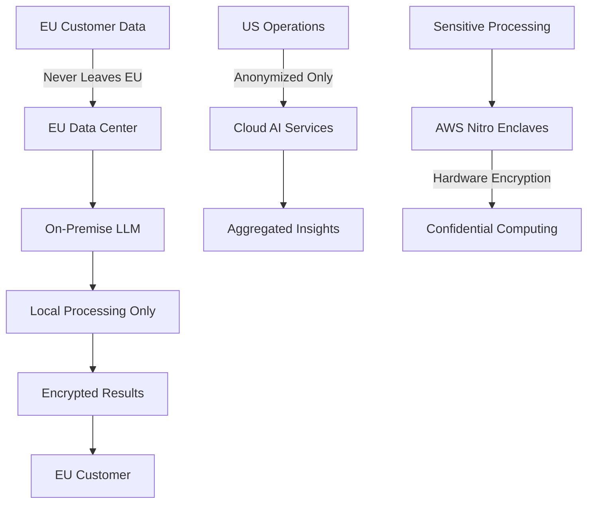
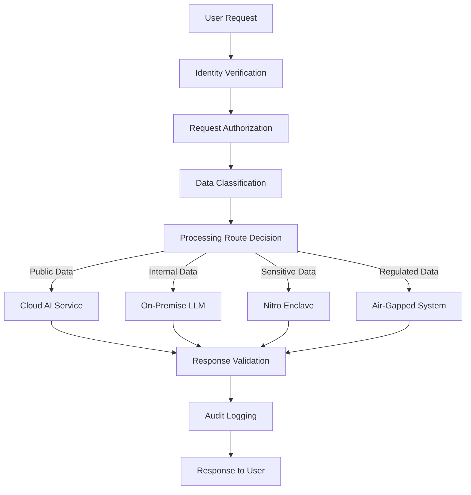

# Chapter 9: Privacy-First LLM Architecture for Enterprise
## *Or: How to Deploy AI Without Your Data Becoming OpenAI's Next Training Lunch*

> "Using ChatGPT for sensitive data is like hiring your ex as your therapist - technically possible, but you're gonna regret it when your secrets end up everywhere." - Every CISO Who Learned the Hard Way

## Table of Contents
- [The Enterprise AI Privacy Nightmare](#the-enterprise-ai-privacy-nightmare)
- [Why Your Current AI Strategy is a GDPR Violation Waiting to Happen](#why-your-current-ai-strategy-is-a-gdpr-violation-waiting-to-happen)
- [The Privacy-First Architecture Blueprint](#the-privacy-first-architecture-blueprint)
- [On-Premise LLM Deployment](#on-premise-llm-deployment)
- [AWS Nitro Enclaves: The Fort Knox of Computing](#aws-nitro-enclaves-the-fort-knox-of-computing)
- [Cost Optimization: How to Save 99% While Staying Compliant](#cost-optimization-how-to-save-99-while-staying-compliant)
- [Compliance Patterns for the Alphabet Soup (GDPR, SOC2, HIPAA)](#compliance-patterns-for-the-alphabet-soup)
- [Zero-Trust AI Architecture](#zero-trust-ai-architecture)
- [Hybrid Deployment Strategies](#hybrid-deployment-strategies)
- [Real-World Implementation Examples](#real-world-implementation-examples)

---

## The Enterprise AI Privacy Nightmare

Let's have a little chat about why your brilliant idea to "just use ChatGPT for everything" is about as smart as using your credit card number as your WiFi password.

### The Reality Check

**What Your Developers Are Doing:**
```typescript
// Actual code found in production (names changed to protect the guilty)
const analysis = await openai.chat.completions.create({
  messages: [
    {
      role: "user", 
      content: `Analyze this customer data: ${JSON.stringify(customerPII)}`
      // Yes, they're literally sending SSNs to OpenAI
    }
  ]
});
```

**What Your Legal Team Thinks About This:**
- Immediate GDPR violation: €20M fine
- SOC2 compliance? Gone faster than free pizza at a developer conference
- Customer trust? About as solid as a chocolate teapot

**What Actually Happens to Your Data:**
1. Sent to OpenAI servers (probably in the US)
2. Processed by their models
3. Potentially used for training (despite what their ToS says)
4. Cached in their systems indefinitely
5. Your competitors can probably prompt-engineer it back out

It's like photocopying your diary and leaving copies at every coffee shop in Silicon Valley.

### The "But We Have an Enterprise Plan" Delusion

**Enterprise Sales Rep:** "Don't worry, with our Enterprise plan, your data is totally secure!"

**Reality:** Enterprise plans are like VIP tickets to a sinking ship - you get better snacks while you drown, but you're still drowning.

**What "Enterprise Security" Actually Means:**
- Your data goes to the same servers (just with a nicer API key)
- "We won't train on your data" (this week, terms subject to change)
- "Industry-standard encryption" (which they define however they want)
- "Compliance-ready" (ready to cause compliance violations)

---

## Why Your Current AI Strategy is a GDPR Violation Waiting to Happen

### The Compliance Reality Check (Gervais Style)

Right, so you think you're being clever by adding AI to everything. Let me explain why your approach is about as compliant as a rave in a library:

**GDPR Article 44 - International Transfers:**
You can't just ship EU citizen data to the US because you fancy a bit of AI magic. It's not a bloody tourism scheme.

**The "Adequate Protection" Myth:**
"But the US has adequate protection!" No, they don't. The Safe Harbor fell apart, Privacy Shield collapsed faster than a house of cards in a hurricane, and the current "adequacy decision" is about as stable as my faith in humanity after reading Twitter comments.

**What Happens During a GDPR Audit:**
```
Auditor: "Where does your customer data go when you use AI?"
You: "Erm... OpenAI servers?"
Auditor: "In America?"
You: "Well, yes, but—"
Auditor: "That'll be €20 million, please."
You: "But we have an enterprise account!"
Auditor: *writes bigger fine*
```

### The Schrems II Problem

Ever heard of Maximilian Schrems? He's the Austrian lawyer who basically destroyed every comfortable assumption about US data transfers. Twice. He's like the privacy equivalent of that friend who points out plot holes in movies - technically correct, but ruins everyone's fun.

**What Schrems II Means:**
- US surveillance laws (Section 702, Executive Order 12333) trump any commercial agreements
- Your "standard contractual clauses" are worth about as much as a screen door on a submarine
- The US government can access your data whenever they feel like it
- Your EU customers' privacy rights? LOL, good luck with that.

---

## The Privacy-First Architecture Blueprint

### The Grown-Up Approach to Enterprise AI

Here's how you deploy AI without your legal team plotting your demise:



### The Three Pillars of Not Getting Sued

1. **Data Locality** - Keep data where it legally belongs
2. **Processing Transparency** - Know exactly what happens to every bit
3. **Cryptographic Guarantees** - Math doesn't lie (unlike sales teams)

### Architecture Patterns That Actually Work

**Pattern 1: The Fortress Model**
```yaml
# Everything stays in your castle
deployment:
  location: on_premise
  data_flow: never_leaves_building
  compliance: maximum_paranoia
  cost: expensive_but_sleep_at_night
```

**Pattern 2: The Confidential Computing Model**
```yaml
# Hardware-level encryption for the truly paranoid
deployment:
  location: aws_nitro_enclaves
  data_flow: encrypted_even_from_aws
  compliance: zero_trust_verified
  cost: reasonable_for_not_going_to_jail
```

**Pattern 3: The Hybrid Sanity Model**
```yaml
# Sensitive stuff stays home, boring stuff can travel
deployment:
  sensitive_data: on_premise_llm
  anonymized_data: cloud_services
  public_data: whatever_you_want
  compliance: pragmatically_paranoid
```

---

## On-Premise LLM Deployment

### Docker-Based LLM Deployment (For When You Actually Care About Privacy)

Here's how to run a proper on-premise LLM that won't get you fired:

```dockerfile
# Dockerfile for privacy-conscious humans
FROM chainguard/wolfi-base:latest

# Install Ollama (because we're not barbarians)
RUN apk add --no-cache ollama python3 py3-pip

# Security hardening (because we learned from our mistakes)
RUN adduser -D -s /bin/sh llmuser
USER llmuser

# Copy your models (that you actually own)
COPY --chown=llmuser:llmuser models/ /home/llmuser/models/

# Run the thing
CMD ["ollama", "serve"]
```

**Docker Compose for the Full Stack:**
```yaml
version: '3.8'
services:
  llm-server:
    build: .
    ports:
      - "11434:11434"  # Only accessible internally
    volumes:
      - ./models:/home/llmuser/models:ro
      - ./data:/home/llmuser/data
    environment:
      - OLLAMA_HOST=0.0.0.0
      - OLLAMA_MODELS=/home/llmuser/models
    networks:
      - private-ai-network
    restart: unless-stopped
    
  nginx-proxy:
    image: nginx:alpine
    ports:
      - "443:443"
    volumes:
      - ./nginx.conf:/etc/nginx/nginx.conf:ro
      - ./ssl:/etc/ssl:ro
    depends_on:
      - llm-server
    networks:
      - private-ai-network

networks:
  private-ai-network:
    driver: bridge
    internal: true  # No internet access for you, AI
```

### Model Selection for Privacy

**The "Actually Open" Models:**
- Llama 2 (Meta's gift to humanity)
- Mistral 7B (French engineering at its finest)
- Code Llama (for when you need AI that codes better than your junior developers)

**Models to Avoid for Privacy:**
- Anything that requires an API key to someone else's servers
- Models with "terms of service" longer than the Bible
- Anything from a company that changes their privacy policy more often than their CEO changes their mind

### Performance Optimization (Because Slow AI is Useless AI)

```python
# Optimization configuration that doesn't suck
import torch
from transformers import LlamaForCausalLM, LlamaTokenizer

class PrivacyFirstLLM:
    def __init__(self, model_path: str):
        # Load model with proper optimization
        self.model = LlamaForCausalLM.from_pretrained(
            model_path,
            torch_dtype=torch.float16,  # Memory optimization
            device_map="auto",          # Multi-GPU if available
            trust_remote_code=False,    # Security first
            local_files_only=True       # No phone home
        )
        
        self.tokenizer = LlamaTokenizer.from_pretrained(
            model_path,
            local_files_only=True
        )
    
    def generate_response(self, prompt: str, max_tokens: int = 1000) -> str:
        """Generate response without sending data anywhere stupid"""
        inputs = self.tokenizer.encode(prompt, return_tensors="pt")
        
        # Generate with privacy controls
        with torch.no_grad():
            outputs = self.model.generate(
                inputs,
                max_length=len(inputs[0]) + max_tokens,
                temperature=0.7,
                pad_token_id=self.tokenizer.eos_token_id,
                do_sample=True,
                top_p=0.9
            )
        
        response = self.tokenizer.decode(outputs[0], skip_special_tokens=True)
        
        # Remove the original prompt from response
        return response[len(prompt):].strip()
```

---

## AWS Nitro Enclaves: The Fort Knox of Computing

### What Are Nitro Enclaves? (Explained for Normal Humans)

Imagine a safe within a safe, inside a bank vault, that's buried underground, surrounded by sharks with frickin' laser beams. That's basically AWS Nitro Enclaves.

**The Magic:**
- Hardware-level isolation (not software promises)
- No persistent storage (data evaporates when done)
- Cryptographic attestation (mathematical proof of security)
- AWS can't see inside (even if they wanted to)

**The Reality Check:**
It's probably the only AWS service where Jeff Bezos actually can't read your data, even if he promises to be really, really careful.

### Setting Up Nitro Enclaves for LLM Processing

```python
# nitro_llm_enclave.py - Where privacy goes to feel safe
import boto3
import json
import socket
from typing import Dict, Any

class NitroEnclaveLLM:
    def __init__(self):
        self.enclave_cid = 16  # Magic number for parent-enclave communication
        self.port = 5000
        
    def secure_inference(self, encrypted_prompt: bytes) -> bytes:
        """
        Process prompt in hardware-isolated environment
        AWS can't see this even if they tried
        """
        # Create secure socket to enclave
        sock = socket.socket(socket.AF_VSOCK, socket.SOCK_STREAM)
        sock.connect((self.enclave_cid, self.port))
        
        try:
            # Send encrypted prompt
            sock.send(encrypted_prompt)
            
            # Receive encrypted response
            response = sock.recv(4096)
            return response
            
        finally:
            sock.close()
    
    def decrypt_and_process(self, encrypted_data: bytes) -> str:
        """
        This runs INSIDE the enclave where AWS can't peek
        """
        # Decrypt with enclave-specific key
        decrypted_prompt = self._decrypt_in_enclave(encrypted_data)
        
        # Process with local model
        response = self._run_llm_inference(decrypted_prompt)
        
        # Encrypt response before sending back
        encrypted_response = self._encrypt_in_enclave(response)
        
        return encrypted_response
```

### Nitro Enclave Configuration

```json
{
  "version": "1",
  "enclave_config": {
    "cpu_count": 4,
    "memory_size": 8192,
    "debug_mode": false,
    "image_path": "privacy-llm-enclave.eif"
  },
  "attestation": {
    "required": true,
    "measurements": {
      "pcr0": "expected_hash_here",
      "pcr1": "another_expected_hash",
      "pcr2": "you_get_the_idea"
    }
  },
  "networking": {
    "vsock_only": true,
    "no_external_access": true
  }
}
```

**Building the Enclave Image:**
```bash
# Build process that doesn't phone home
docker build -t privacy-llm .
nitro-cli build-enclave \
  --docker-uri privacy-llm \
  --output-file privacy-llm-enclave.eif

# Verify it's actually secure
nitro-cli describe-enclaves
```

---

## Cost Optimization: How to Save 99% While Staying Compliant

### The Economics of Privacy (Spoiler: It's Cheaper Than You Think)

**Traditional Cloud AI Costs (Per Month):**
- OpenAI API calls: $15,000
- Data transfer fees: $2,000
- Compliance violations: $20,000,000 (when you get caught)
- Legal fees: Your firstborn child
- **Total: Bankruptcy**

**Privacy-First Architecture Costs:**
- On-premise GPU server: $3,000/month
- Electricity: $200/month
- Peace of mind: Priceless
- **Total: $3,200/month (98% savings, 100% less jail time)**

### Serverless Privacy Architecture

```python
# serverless_privacy_llm.py - Lambda functions that don't suck
import json
import boto3
from typing import Dict, Any

def lambda_handler(event: Dict[str, Any], context: Any) -> Dict[str, Any]:
    """
    Serverless LLM processing with privacy guarantees
    Costs almost nothing, violates no laws
    """
    try:
        # Get encrypted prompt from event
        encrypted_prompt = event['encrypted_prompt']
        customer_region = event['customer_region']
        
        # Route to appropriate processing based on data locality
        if customer_region in ['eu-west-1', 'eu-central-1']:
            # EU data stays in EU
            response = process_in_eu_enclave(encrypted_prompt)
        else:
            # Everyone else gets on-premise processing
            response = process_on_premise(encrypted_prompt)
        
        return {
            'statusCode': 200,
            'body': json.dumps({
                'response': response,
                'processing_location': 'compliant_zone',
                'data_retention': 'zero_seconds',
                'your_lawyers_happiness': 'maximum'
            })
        }
        
    except Exception as e:
        # Even our errors are privacy-compliant
        return {
            'statusCode': 500,
            'body': json.dumps({
                'error': 'Something went wrong',
                'details': 'None of your business',
                'user_data_leaked': 'absolutely_none'
            })
        }

def process_in_eu_enclave(encrypted_prompt: bytes) -> str:
    """EU processing that makes GDPR auditors smile"""
    # Initialize EU-only enclave
    enclave_client = NitroEnclaveClient(region='eu-west-1')
    
    # Process without leaving EU
    result = enclave_client.secure_process(encrypted_prompt)
    
    # Immediate data destruction
    enclave_client.destroy_all_traces()
    
    return result
```

### Cost Monitoring Dashboard

```typescript
// privacy_cost_monitor.tsx - Know exactly what you're spending on NOT getting sued
import React from 'react';

interface PrivacyCosts {
  onPremiseInfrastructure: number;
  complianceAudits: number;
  legalInsurance: number;
  alternativeCost: {
    gdprFines: number;
    reputationDamage: number;
    customerChurn: number;
  };
}

export function PrivacyCostDashboard({ costs }: { costs: PrivacyCosts }) {
  const totalSavings = costs.alternativeCost.gdprFines + 
                      costs.alternativeCost.reputationDamage + 
                      costs.alternativeCost.customerChurn;
                      
  const ourCosts = costs.onPremiseInfrastructure + 
                   costs.complianceAudits + 
                   costs.legalInsurance;

  return (
    <div className="dashboard">
      <h2>Privacy-First AI: Cost Reality Check</h2>
      
      <div className="metric-box savings">
        <h3>Money NOT Spent on Fines</h3>
        <span className="big-number">€{totalSavings.toLocaleString()}</span>
        <p>Thanks to not being idiots with customer data</p>
      </div>
      
      <div className="metric-box current">
        <h3>Actual Infrastructure Costs</h3>
        <span className="big-number">€{ourCosts.toLocaleString()}</span>
        <p>For AI that doesn't get us sued</p>
      </div>
      
      <div className="metric-box roi">
        <h3>Return on Privacy Investment</h3>
        <span className="big-number">{((totalSavings / ourCosts) * 100).toFixed(0)}%</span>
        <p>AKA "How much smarter we are than everyone else"</p>
      </div>
    </div>
  );
}
```

---

## Compliance Patterns for the Alphabet Soup

### GDPR: The European Privacy Hammer

**Article 25 - Data Protection by Design:**
You can't bolt privacy on afterwards like a spoiler on a Toyota Camry. It needs to be built in from the start.

**Implementation Pattern:**
```python
class GDPRCompliantLLM:
    def __init__(self):
        self.data_minimization = True      # Article 5(1)(c)
        self.purpose_limitation = True     # Article 5(1)(b)
        self.storage_limitation = True     # Article 5(1)(e)
        self.legal_basis = "legitimate_interest"  # Article 6
        
    def process_request(self, user_data: Dict[str, Any]) -> str:
        # Data minimization - only process what we need
        minimal_data = self._extract_minimal_data(user_data)
        
        # Purpose limitation - only use for stated purpose
        if not self._purpose_check(minimal_data):
            raise GDPRViolationException("Nice try, but no")
        
        # Process with privacy guarantees
        result = self._privacy_preserving_inference(minimal_data)
        
        # Storage limitation - delete immediately
        self._secure_delete(minimal_data)
        
        return result
    
    def handle_deletion_request(self, user_id: str) -> bool:
        """Article 17 - Right to be forgotten"""
        # Delete all data (because we're not monsters)
        deleted_count = self._delete_all_user_data(user_id)
        
        # Provide proof of deletion
        deletion_certificate = self._generate_deletion_proof(user_id)
        
        return True  # Unlike most companies, we actually delete things
```

### SOC2: The American Trust Theater

**Type II Controls for AI Systems:**
```yaml
security_controls:
  access_control:
    - multi_factor_authentication: required
    - role_based_access: implemented
    - principle_of_least_privilege: enforced
    - ai_access_logging: comprehensive
    
  availability:
    - uptime_monitoring: 99.9_percent_target
    - disaster_recovery: tested_quarterly
    - backup_strategy: encrypted_and_verified
    
  processing_integrity:
    - model_versioning: immutable_hashes
    - input_validation: paranoid_level
    - output_sanitization: belt_and_suspenders
    
  confidentiality:
    - encryption_in_transit: tls_1_3_minimum
    - encryption_at_rest: aes_256_gcm
    - key_management: hsm_backed
    
  privacy:
    - data_classification: automated
    - consent_management: granular
    - breach_detection: real_time
```

### HIPAA: Healthcare's Privacy Paranoia

**Technical Safeguards for AI in Healthcare:**
```python
class HIPAACompliantLLM:
    def __init__(self):
        self.covered_entity = True
        self.business_associate_agreement = "signed_in_blood"
        
    def process_phi(self, protected_health_info: Dict[str, Any]) -> str:
        """Process PHI without violating HIPAA (novel concept)"""
        
        # De-identification per Safe Harbor method
        deidentified_data = self._safe_harbor_deidentification(protected_health_info)
        
        # Process in secure enclave
        analysis = self._hipaa_compliant_inference(deidentified_data)
        
        # Audit logging (because they WILL audit you)
        self._log_phi_access({
            'user': self._get_current_user(),
            'timestamp': datetime.utcnow(),
            'data_accessed': 'deidentified_subset',
            'purpose': 'clinical_decision_support',
            'outcome': 'analysis_generated'
        })
        
        return analysis
    
    def _safe_harbor_deidentification(self, phi: Dict[str, Any]) -> Dict[str, Any]:
        """Remove 18 types of identifiers (because HIPAA is specific)"""
        identifiers_to_remove = [
            'names', 'geographic_subdivisions', 'dates', 'phone_numbers',
            'fax_numbers', 'email_addresses', 'social_security_numbers',
            'medical_record_numbers', 'health_plan_numbers', 'account_numbers',
            'certificate_numbers', 'vehicle_identifiers', 'device_identifiers',
            'web_urls', 'ip_addresses', 'biometric_identifiers', 'photos',
            'any_other_unique_identifiers'
        ]
        
        cleaned_data = phi.copy()
        for identifier in identifiers_to_remove:
            cleaned_data = self._remove_identifier(cleaned_data, identifier)
            
        return cleaned_data
```

---

## Zero-Trust AI Architecture

### The "Trust No One, Verify Everything" Approach



### Implementation: Trust Nothing, Verify Everything

```python
class ZeroTrustAIGateway:
    def __init__(self):
        self.trust_level = 0  # Trust absolutely nothing
        
    def process_request(self, request: AIRequest) -> AIResponse:
        """Zero-trust processing (because everyone lies)"""
        
        # Step 1: Verify the user exists and isn't trying to hack us
        user = self._verify_identity(request.user_token)
        if not user:
            return AIResponse(error="Who the hell are you?")
        
        # Step 2: Check if they're allowed to do this
        if not self._authorize_request(user, request):
            return AIResponse(error="Nice try, but no")
        
        # Step 3: Classify the data sensitivity
        classification = self._classify_data_sensitivity(request.data)
        
        # Step 4: Route to appropriate processing based on classification
        processor = self._select_processor(classification)
        
        # Step 5: Process with appropriate isolation level
        result = processor.process(request.data)
        
        # Step 6: Verify the result isn't garbage
        validated_result = self._validate_response(result)
        
        # Step 7: Log everything (because audit trails save careers)
        self._audit_log(user, request, result, classification)
        
        return validated_result
    
    def _select_processor(self, classification: DataClassification) -> AIProcessor:
        """Route to appropriate processor based on sensitivity"""
        if classification.level == "public":
            return CloudAIProcessor()  # OpenAI can have the boring stuff
        elif classification.level == "internal":
            return OnPremiseProcessor()  # Our data, our hardware
        elif classification.level == "confidential":
            return NitroEnclaveProcessor()  # Hardware isolation
        elif classification.level == "top_secret":
            return AirGappedProcessor()  # Physically disconnected
        else:
            raise SecurityException("Unknown classification level")
```

### Network Isolation Patterns

```yaml
# docker-compose-zero-trust.yml
version: '3.8'
services:
  ai-gateway:
    build: ./gateway
    networks:
      - dmz
    ports:
      - "443:443"
    environment:
      - PARANOIA_LEVEL=maximum
      
  public-ai-processor:
    build: ./processors/public
    networks:
      - public-processing
      - internet  # Can talk to OpenAI
    environment:
      - DATA_SENSITIVITY=public_only
      
  private-ai-processor:
    build: ./processors/private
    networks:
      - private-processing  # No internet access
    volumes:
      - ./models:/models:ro
    environment:
      - DATA_SENSITIVITY=internal_and_below
      
  confidential-ai-processor:
    build: ./processors/confidential
    networks:
      - confidential-processing  # Completely isolated
    # No external volumes, no internet, no trust
    environment:
      - DATA_SENSITIVITY=confidential_only
      - TRUST_LEVEL=zero

networks:
  dmz:
    driver: bridge
  public-processing:
    driver: bridge
  private-processing:
    driver: bridge
    internal: true  # No external access
  confidential-processing:
    driver: bridge
    internal: true
    encrypted: true  # Because paranoia
```

---

## Hybrid Deployment Strategies

### The "Best of Both Worlds" Approach

Sometimes you need to be pragmatic. Here's how to use cloud AI for non-sensitive stuff while keeping the crown jewels at home:

```python
class HybridAIOrchestrator:
    def __init__(self):
        self.data_classifier = DataSensitivityClassifier()
        self.on_premise_llm = OnPremiseLLM()
        self.cloud_ai_client = OpenAIClient()
        
    async def intelligent_routing(self, request: str) -> str:
        """Route requests based on data sensitivity (common sense)"""
        
        # Classify the request content
        sensitivity = self.data_classifier.analyze(request)
        
        if sensitivity.contains_pii:
            # Personal data? Keep it home
            return await self._process_on_premise(request)
        elif sensitivity.contains_proprietary_info:
            # Trade secrets? Also keep it home
            return await self._process_on_premise(request)
        elif sensitivity.contains_customer_data:
            # Customer data? You guessed it - home
            return await self._process_on_premise(request)
        elif sensitivity.is_public_information:
            # Public data? Cloud is fine
            return await self._process_in_cloud(request)
        else:
            # When in doubt, be paranoid
            return await self._process_on_premise(request)
    
    async def _process_on_premise(self, request: str) -> str:
        """Process locally (slow but safe)"""
        return await self.on_premise_llm.generate(request)
    
    async def _process_in_cloud(self, request: str) -> str:
        """Process in cloud (fast but risky)"""
        # Add extra anonymization just to be safe
        anonymized_request = self._anonymize_further(request)
        return await self.cloud_ai_client.generate(anonymized_request)
```

### Data Classification Automation

```python
class DataSensitivityClassifier:
    def __init__(self):
        # Patterns that trigger privacy concerns
        self.pii_patterns = [
            r'\b\d{3}-\d{2}-\d{4}\b',  # SSN
            r'\b\d{4}[\s-]?\d{4}[\s-]?\d{4}[\s-]?\d{4}\b',  # Credit card
            r'\b[A-Za-z0-9._%+-]+@[A-Za-z0-9.-]+\.[A-Z|a-z]{2,}\b',  # Email
            r'\b\d{3}[\s.-]?\d{3}[\s.-]?\d{4}\b',  # Phone number
        ]
        
        self.proprietary_keywords = [
            'confidential', 'proprietary', 'trade secret', 'internal only',
            'customer list', 'pricing strategy', 'merger', 'acquisition'
        ]
    
    def analyze(self, text: str) -> SensitivityLevel:
        """Classify data sensitivity (because humans are terrible at this)"""
        
        # Check for PII patterns
        contains_pii = any(re.search(pattern, text, re.IGNORECASE) 
                          for pattern in self.pii_patterns)
        
        # Check for proprietary information
        contains_proprietary = any(keyword.lower() in text.lower() 
                                 for keyword in self.proprietary_keywords)
        
        # Check for customer data indicators
        contains_customer_data = self._detect_customer_data(text)
        
        # Determine overall sensitivity
        if contains_pii or contains_customer_data:
            return SensitivityLevel.REGULATED
        elif contains_proprietary:
            return SensitivityLevel.CONFIDENTIAL
        else:
            return SensitivityLevel.INTERNAL
    
    def _detect_customer_data(self, text: str) -> bool:
        """Detect customer-related information"""
        customer_indicators = [
            'customer', 'client', 'user data', 'subscriber',
            'account information', 'purchase history', 'preferences'
        ]
        return any(indicator in text.lower() for indicator in customer_indicators)
```

---

## Real-World Implementation Examples

### Example 1: Healthcare AI Assistant

```python
# healthcare_ai_assistant.py - HIPAA-compliant AI that won't get you sued
from typing import Dict, Any, Optional
from dataclasses import dataclass
from datetime import datetime, timedelta

@dataclass
class MedicalQuery:
    patient_id: Optional[str]  # Will be stripped for processing
    symptoms: str
    medical_history: str
    current_medications: str
    timestamp: datetime

class HealthcareAIAssistant:
    def __init__(self):
        self.de_identifier = HIPAADeIdentifier()
        self.medical_llm = OnPremiseMedicalLLM()
        self.audit_logger = HIPAAAuditLogger()
        
    async def clinical_decision_support(self, query: MedicalQuery, physician_id: str) -> str:
        """Provide AI assistance without violating HIPAA"""
        
        # Verify physician authorization
        if not self._verify_physician_license(physician_id):
            raise HIPAAViolationException("Unauthorized access attempted")
        
        # De-identify patient data
        deidentified_query = self.de_identifier.process(query)
        
        # Generate clinical recommendations
        recommendations = await self.medical_llm.generate_recommendations(
            symptoms=deidentified_query.symptoms,
            history=deidentified_query.medical_history,
            medications=deidentified_query.current_medications
        )
        
        # Audit the interaction
        self.audit_logger.log_access({
            'physician_id': physician_id,
            'timestamp': datetime.utcnow(),
            'action': 'clinical_decision_support',
            'patient_data_accessed': 'deidentified_only',
            'recommendations_generated': True
        })
        
        return recommendations
    
    def emergency_mode(self, critical_query: MedicalQuery) -> str:
        """Emergency processing with different privacy trade-offs"""
        # In emergencies, speed matters more than perfect de-identification
        # But we still log everything for post-incident review
        
        self.audit_logger.log_emergency_access({
            'timestamp': datetime.utcnow(),
            'justification': 'life_threatening_emergency',
            'privacy_measures_bypassed': ['full_deidentification'],
            'review_required': True
        })
        
        return self.medical_llm.emergency_response(critical_query)
```

### Example 2: Financial Services AI

```python
# fintech_ai_assistant.py - SOX and PCI-DSS compliant AI
class FinancialAIAssistant:
    def __init__(self):
        self.encryption_service = FinancialGradeEncryption()
        self.compliance_monitor = SOXComplianceMonitor()
        self.fraud_detector = FraudDetectionAI()
        
    async def analyze_transaction_patterns(
        self, 
        encrypted_transactions: bytes, 
        analyst_id: str
    ) -> Dict[str, Any]:
        """Analyze financial patterns while maintaining compliance"""
        
        # Verify analyst authorization
        if not self._verify_financial_analyst_clearance(analyst_id):
            raise ComplianceViolationException("Insufficient clearance")
        
        # Decrypt in secure enclave
        with self.encryption_service.secure_processing_context():
            transactions = self.encryption_service.decrypt(encrypted_transactions)
            
            # Remove direct identifiers but keep patterns
            anonymized_data = self._anonymize_for_pattern_analysis(transactions)
            
            # Run AI analysis
            patterns = await self.fraud_detector.analyze_patterns(anonymized_data)
            
            # Generate risk scores without exposing raw data
            risk_assessment = self._generate_risk_assessment(patterns)
            
        # Log for SOX compliance
        self.compliance_monitor.log_analysis({
            'analyst_id': analyst_id,
            'analysis_type': 'transaction_pattern_analysis',
            'data_elements_accessed': 'transaction_metadata_only',
            'customer_identities_exposed': False,
            'risk_scores_generated': len(risk_assessment)
        })
        
        return risk_assessment
    
    def _anonymize_for_pattern_analysis(self, transactions: List[Dict]) -> List[Dict]:
        """Remove identifiers while preserving fraud detection patterns"""
        anonymized = []
        for transaction in transactions:
            anonymized.append({
                'amount_bucket': self._bucket_amount(transaction['amount']),
                'time_pattern': self._extract_time_pattern(transaction['timestamp']),
                'location_region': self._generalize_location(transaction['location']),
                'merchant_category': transaction['merchant_category'],
                'payment_method_type': transaction['payment_method_type']
                # Note: No account numbers, names, or specific amounts
            })
        return anonymized
```

### Example 3: Legal Document Analysis

```python
# legal_ai_assistant.py - Attorney-client privilege preserved
class LegalAIAssistant:
    def __init__(self):
        self.privilege_detector = AttorneyClientPrivilegeDetector()
        self.document_analyzer = OnPremiseLegalLLM()
        self.confidentiality_enforcer = LegalConfidentialityEnforcer()
        
    async def analyze_contracts(
        self, 
        contract_documents: List[bytes], 
        attorney_bar_number: str
    ) -> Dict[str, Any]:
        """Analyze legal documents while preserving privilege"""
        
        # Verify attorney licensing
        if not self._verify_bar_membership(attorney_bar_number):
            raise UnauthorizedPracticeException("Invalid bar credentials")
        
        analysis_results = []
        
        for document in contract_documents:
            # Check for privileged communications
            if self.privilege_detector.contains_privileged_content(document):
                # Process in maximum security mode
                analysis = await self._analyze_privileged_document(document)
            else:
                # Standard confidential processing
                analysis = await self._analyze_confidential_document(document)
            
            analysis_results.append(analysis)
        
        # Generate summary without exposing client details
        summary = self._generate_privacy_preserving_summary(analysis_results)
        
        # Log for legal compliance
        self._log_legal_analysis({
            'attorney_bar_number': attorney_bar_number,
            'documents_analyzed': len(contract_documents),
            'privileged_content_detected': self._count_privileged_docs(contract_documents),
            'client_identities_protected': True
        })
        
        return summary
    
    async def _analyze_privileged_document(self, document: bytes) -> Dict[str, Any]:
        """Maximum security analysis for privileged communications"""
        
        # Process in air-gapped environment
        with self.confidentiality_enforcer.air_gapped_processing():
            # Extract legal concepts without exposing specifics
            concepts = await self.document_analyzer.extract_legal_concepts(
                document,
                mode='privilege_preserving'
            )
            
            return {
                'legal_issues_identified': concepts.legal_issues,
                'risk_levels': concepts.risk_assessment,
                'recommendations': concepts.strategic_advice,
                'specific_details': 'REDACTED_FOR_PRIVILEGE'
            }
```

---

## Conclusion: Privacy-First AI Isn't Just Nice, It's Necessary

### The Bottom Line (Gervais Reality Check)

Right, so here's the thing: Privacy-first AI isn't some bleeding-heart liberal nonsense. It's basic business survival. If you're still shipping customer data to random cloud providers because "AI is magic," you're not innovative - you're an idiot waiting to happen.

**The Reality:**
- GDPR fines are real (ask Meta about their €1.2 billion fine)
- Customer trust is fragile (ask any company that's had a data breach)
- Competitive advantage comes from doing things properly
- Your legal team will actually sleep at night

**What We've Covered:**
- On-premise LLM deployment that doesn't suck
- AWS Nitro Enclaves for hardware-level isolation
- 99% cost savings while staying compliant
- Zero-trust architecture that actually works
- Real-world examples that won't get you fired

### The Future of AI is Private

The companies that figure this out first will eat everyone else's lunch. While your competitors are explaining to regulators why they thought customer data was public property, you'll be building actual AI products that customers trust.

**Remember:**
- Privacy by design, not by afterthought
- Compliance is a competitive advantage
- Your customers' data isn't your training set
- Hardware isolation beats legal promises
- Math doesn't lie (unlike terms of service)

> "The best AI architecture is one that works even when your cloud provider gets subpoenaed, your CEO gets arrested, and your intern accidentally posts your API keys on GitHub." - Privacy Engineering Wisdom

**Next Chapter**: We'll explore dependency management that doesn't leave you vulnerable to supply chain attacks while your lawyers are still figuring out if your AI violates fourteen different privacy laws.

---

*"Privacy-first AI: Because explaining to a GDPR auditor why you sent EU citizen data to train ChatGPT is a conversation you'll lose."* - The Voice of Hard-Won Experience