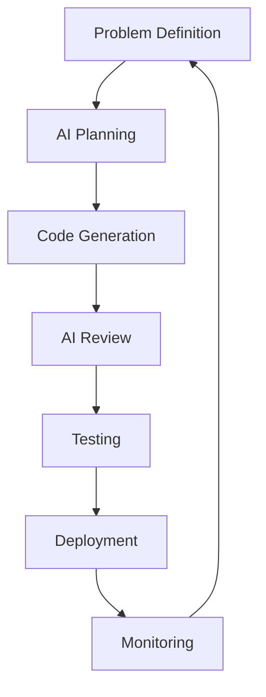

# Development Tools
## *AI-Enhanced Modern Development Workflows*

> "A fool with a tool is still a fool. But a competent developer with good tools is basically a wizard." - Modern Development Wisdom

Welcome to the future of development - where AI assistants help you code, automated tools catch your mistakes, and your workflow is so smooth it feels like cheating (because it kind of is).

## AI-Assisted Development

### 🤖 **Claude Code Mastery**

Claude Code isn't just a chatbot with delusions of grandeur - it's a fundamental shift in how we approach development.

#### [Mastering Claude Code](./mastering-claude-code.md)
<div class="skills-progress-indicator intermediate">🟡 Game Changer</div>

**Simple Explanation:** Learn to code with an AI pair programmer that never gets tired, never judges your 3 AM code, and actually knows what it's doing.

**Reality Check:** AI won't replace developers, but developers using AI will replace developers who don't.

**What You'll Master:**
- Advanced prompting techniques
- Code review and debugging workflows  
- Architecture planning with AI
- Test-driven development acceleration

#### [Claude Code Workshop](./claude-code-workshop.md)
<div class="skills-progress-indicator beginner">🟢 Hands-On</div>

**Practical Application:** Real scenarios, real problems, real solutions.

Interactive workshop covering:
- Setting up effective development workflows
- AI-assisted debugging sessions
- Code refactoring techniques
- Collaborative development patterns

#### [Claude Code Orchestration](./claude-code-orchestration.md)
<div class="skills-progress-indicator advanced">🔴 Advanced</div>

**For Teams:** How to integrate AI development across your entire workflow.

Advanced topics:
- Team collaboration strategies
- Code review automation
- Documentation generation
- Testing pipeline integration

### 🎭 **Vibe Coding**

#### [Vibe Coding](../concepts/vibe-coding.md)
<div class="skills-progress-indicator intermediate">🟡 Philosophy</div>

**Simple Explanation:** Code based on feel and intuition, then let tools validate your hunches.

**Why This Matters:** Sometimes the best code comes from following your instincts, not rigid rules.

### 🔧 **Alternative AI Tools**

#### [Mastering Gemini CLI](./mastering-gemini-cli.md)
<div class="skills-progress-indicator intermediate">🟡 Alternative</div>

**When Claude Isn't Available:** Google's Gemini as a development assistant.

Learn to leverage:
- Command-line integration
- Code analysis capabilities
- Multi-modal development (text + images)
- Performance comparison with other AI tools

## Testing & Quality Tools

### 🧪 **Modern Testing Workflows**

#### [Playwright MCP Mastery](./playwright-mcp-mastery.md)
<div class="skills-progress-indicator advanced">🔴 Web Testing</div>

**Simple Explanation:** Test web applications like a user, not like a robot following a script.

**Why Playwright:** Because Selenium feels like using a rotary phone to order an Uber.

**Advanced Features:**
- Model Context Protocol integration
- Cross-browser testing automation
- Visual regression testing
- API testing integration

### ⚡ **Code Quality Automation**

#### [Pre-commit Hooks with Claude Code](../concepts/pre-commit-hooks-claude-code.md)
<div class="skills-progress-indicator intermediate">🟡 Essential</div>

**Simple Explanation:** Automatically catch problems before they become problems.

**Developer Truth:** Pre-commit hooks are like having a really pedantic friend who checks your work - annoying but ultimately helpful.

**Automated Checks:**
- Code formatting and linting
- Security vulnerability scanning
- Test coverage requirements
- AI-assisted code review

## Tool Categories

### 🎯 **Essential Daily Tools**

**For Every Developer:**
- **Code Editor:** VS Code with AI extensions
- **Version Control:** Git with modern workflows
- **Terminal:** Modern shell with productivity enhancements
- **AI Assistant:** Claude Code (primary) + alternatives

### 🚀 **Productivity Multipliers**

**For Serious Development:**
- **Containerization:** Docker for environment consistency
- **Testing:** Automated testing frameworks
- **CI/CD:** GitHub Actions or similar
- **Monitoring:** Application and infrastructure monitoring

### ⚡ **Advanced Workflows**

**For Teams and Complex Projects:**
- **Infrastructure as Code:** Terraform, CDK
- **Service Mesh:** When microservices get complex
- **Observability:** Distributed tracing and metrics
- **Security Scanning:** Automated vulnerability detection

## Workflow Patterns

### 🔄 **AI-Enhanced Development Cycle**



**Modern Development Flow:**
1. **Define** the problem clearly
2. **Plan** with AI assistance
3. **Generate** code collaboratively
4. **Review** with AI and humans
5. **Test** automatically
6. **Deploy** confidently
7. **Monitor** continuously

### 🎨 **Tool Selection Philosophy**

**Feynman Principle:** Choose tools you can explain simply.

**Gervais Reality Check:** If you need 17 tools to write Hello World, you're doing it wrong.

**Selection Criteria:**
- **Learning Curve:** Can new team members use it quickly?
- **Maintenance:** Will this tool exist in two years?
- **Integration:** Does it play well with other tools?
- **Value:** Does it solve more problems than it creates?

## Skill Development Paths

### 🌱 **Beginner Path**
1. **Start:** [Claude Code Workshop](./claude-code-workshop.md)
2. **Practice:** Basic AI-assisted development
3. **Expand:** Add pre-commit hooks and basic testing

### 🚀 **Intermediate Path**
1. **Master:** [Claude Code Mastery](./mastering-claude-code.md)
2. **Implement:** [Pre-commit automation](../concepts/pre-commit-hooks-claude-code.md)
3. **Explore:** Alternative AI tools and testing frameworks

### ⚡ **Advanced Path**
1. **Orchestrate:** [Team workflows](./claude-code-orchestration.md)
2. **Automate:** [Complex testing scenarios](./playwright-mcp-mastery.md)
3. **Lead:** Help others adopt AI-enhanced development

## Tool Integration Examples

### Development Environment Setup
```bash
# Modern Python project with AI tools
uv init myproject
cd myproject
uv add --dev pytest ruff mypy pre-commit

# Setup pre-commit hooks
pre-commit install
pre-commit autoupdate

# Configure Claude Code integration
code .  # VS Code with Claude extension
```

### AI-Assisted Debugging
```bash
# Use Claude Code for error analysis
claude debug "TypeError: can't multiply sequence by non-int"

# Generate tests for edge cases
claude test generate --function calculate_discount --edge-cases

# Code review assistance
claude review --diff HEAD~1..HEAD
```

## Common Pitfalls

### 🚨 **AI Tool Misuse**

**The Problem:** Treating AI like a magic solution instead of a powerful tool.

**The Fix:** Learn to ask better questions and validate AI responses.

### 🔧 **Tool Obsession**

**The Problem:** Spending more time configuring tools than solving problems.

**The Fix:** Choose boring, reliable tools that just work.

### 🎯 **Missing Fundamentals**

**The Problem:** Using advanced tools without understanding basics.

**The Fix:** Master core concepts before adding tool complexity.

## What's Next?

### Ready for Domain-Specific Knowledge?
- **[Technical Domains](../technical-domains/index.md)** - Backend, frontend, security specialization
- **[Hands-on Practice](../hands-on-practice/index.md)** - Apply tools to real problems

### Want Structured Learning?
- **[Learning Paths](../learning-paths/index.md)** - Guided courses with tool integration
- **[Core Concepts](../core-concepts/index.md)** - Understanding what tools are built on

---

**Remember:** Tools should enhance your thinking, not replace it. The best developers know when to use tools and when to think for themselves.

*The goal isn't to use every tool available - it's to choose the right tools for the job and use them effectively.*