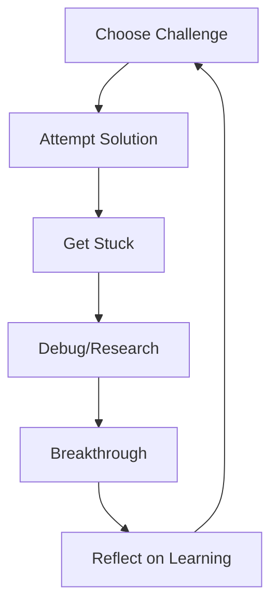

# Hands-on Practice
## *Where Theory Meets Reality (And Usually Gets Mugged)*

> "In theory, theory and practice are the same. In practice, they're not." - Every Developer Ever

This is where the rubber meets the road, where your carefully crafted understanding collides with the chaos of real-world development. Here you'll find tutorials, exercises, and challenges designed to build practical skills through deliberate practice.

## Practice Philosophy

### 🎯 **Learning by Breaking Things**

**Simple Explanation:** The fastest way to understand how something works is to break it systematically and fix it.

**Reality Check:** Most learning happens when things go wrong, not when they go right.

**Our Approach:**
- Start with working examples
- Introduce realistic problems
- Guide you through debugging
- Build intuition through repetition

## Tutorial Categories

### 📝 **Step-by-Step Tutorials**

These are comprehensive, guided experiences that walk you through real-world scenarios.

#### [Web Scraping Tutorial](./web-scraping-tutorial.md)
<div class="skills-progress-indicator intermediate">🟡 Backend</div>

**Project:** Build a production-ready web scraper that doesn't get banned.

**What You'll Build:**
- Respectful scraping system with rate limiting
- Browser automation with stealth techniques  
- Error handling and retry logic
- Data storage and processing pipeline

**Skills Developed:**
- HTTP client programming
- Browser automation
- Ethics and legal considerations
- Production deployment

#### [User Agents & Stealth Tutorial](./user-agents-stealth-tutorial.md)
<div class="skills-progress-indicator intermediate">🟡 Security</div>

**Project:** Navigate the web programmatically without triggering security systems.

**What You'll Learn:**
- Browser fingerprinting avoidance
- Request header optimization
- Behavioral pattern mimicking
- Detection evasion techniques

#### [Database Architecture Tutorial](./database-architecture-tutorial.md)
<div class="skills-progress-indicator advanced">🔴 Backend</div>

**Project:** Design and implement a scalable database system.

**What You'll Build:**
- Normalized schema design
- Query optimization strategies
- Migration system
- Performance monitoring

#### [GUI Patterns Tutorial](./gui-patterns-tutorial.md)
<div class="skills-progress-indicator intermediate">🟡 Frontend</div>

**Project:** Build a modern user interface using proven patterns.

**What You'll Implement:**
- Component-based architecture
- State management
- Responsive design
- Accessibility features

#### [GitHub GraphQL Security Tutorial](./github-graphql-security-tutorial.md)
<div class="skills-progress-indicator advanced">🔴 Security</div>

**Project:** Secure a GraphQL API against common attacks.

**Security Implementations:**
- Query complexity analysis
- Rate limiting
- Authentication/authorization
- Input validation

## Exercise Categories

### 🏋️ **Exercises & Challenges**

Focused skill-building exercises with clear objectives and measurable outcomes.

#### [Claude Code Exercises](../exercises/claude-code-exercises.md)
<div class="skills-progress-indicator beginner">🟢 AI Development</div>

**Focus:** Master AI-assisted development workflows.

**Exercise Types:**
- Prompt engineering challenges
- Code review scenarios
- Debugging with AI assistance
- Architecture planning sessions

#### [GitHub GraphQL Security Exercises](../exercises/github-graphql-security-exercises.md)
<div class="skills-progress-indicator advanced">🔴 Security</div>

**Focus:** Hands-on security implementation and testing.

**Challenge Areas:**
- Vulnerability identification
- Security control implementation
- Penetration testing
- Compliance verification

#### [Language Exercises](../exercises/language-exercises.md)
<div class="skills-progress-indicator intermediate">🟡 Programming</div>

**Focus:** Strengthen programming fundamentals across multiple languages.

**Language Coverage:**
- Python advanced patterns
- Go concurrency
- TypeScript type system
- Cross-language comparisons

#### [Debugging Exercise](../exercises/debugging-exercise.md)
<div class="skills-progress-indicator beginner">🟢 Problem Solving</div>

**Focus:** Systematic debugging methodology.

**Skill Development:**
- Root cause analysis
- Tool usage (debuggers, profilers)
- Hypothesis testing
- Documentation of findings

## Debugging & Troubleshooting

### 🐛 **When Things Go Wrong**

Because they will. A lot.

#### [Debugging Journey](./debugging-journey.md)
<div class="skills-progress-indicator intermediate">🟡 Essential</div>

**Real-World Debugging:** A collection of actual debugging sessions with analysis.

**What You'll Learn:**
- Systematic debugging approach
- Tool selection for different problem types
- When to ask for help
- How to document and share solutions

**Common Scenarios:**
- "It works on my machine" problems
- Performance bottlenecks
- Integration failures
- Production incidents

## Skill Development Paths

### 🌱 **Beginner Practice Path**

**Goal:** Build confidence through guided success.

1. **Start:** [Claude Code Exercises](../exercises/claude-code-exercises.md)
2. **Practice:** [Debugging Exercises](../exercises/debugging-exercise.md)
3. **Apply:** Choose a tutorial that matches your interests

### 🚀 **Intermediate Challenge Path**

**Goal:** Develop real-world problem-solving skills.

1. **Foundation:** Complete 2-3 tutorials in different domains
2. **Challenge:** Take on complex exercises
3. **Integrate:** Combine skills in larger projects

### ⚡ **Advanced Mastery Path**

**Goal:** Build expertise through teaching and creating.

1. **Master:** Complete advanced tutorials and exercises
2. **Contribute:** Help improve existing content
3. **Create:** Design new challenges for others

## Practice Strategies

### 🎯 **Deliberate Practice Principles**

**Focus on Weaknesses:** Spend most time on skills that are just beyond your comfort zone.

**Get Feedback:** Use AI tools, code reviews, and testing to validate your work.

**Reflect and Iterate:** After each exercise, think about what you learned and what to try next.

### 🔄 **Learning Cycle**



**The Productive Struggle:**
1. Choose challenges slightly above your current level
2. Attempt solutions with your current knowledge
3. Get stuck (this is normal and good)
4. Research, debug, ask for help
5. Experience breakthrough understanding
6. Reflect on what you learned
7. Choose the next challenge

## Project Ideas by Skill Level

### 🟢 **Beginner Projects**
- Personal task management system
- Simple web scraper for public data
- Basic REST API with database
- Static website with modern tooling

### 🟡 **Intermediate Projects**
- Real-time collaboration tool
- Data visualization dashboard
- Microservice architecture
- Security audit automation

### 🔴 **Advanced Projects**
- Distributed system with high availability
- Machine learning pipeline
- Security research tool
- Open source contribution

## Tools for Practice

### Development Environment
```bash
# Setup practice environment
git clone https://github.com/cybsecgit/learning
cd learning
make setup-dev

# Start development services
docker-compose up -d

# Run tests and exercises
make test
make exercise EXERCISE=web-scraping
```

### AI-Assisted Practice
```bash
# Get help with exercises
claude help --exercise web-scraping
claude debug --error "Connection timeout"
claude review --file mycode.py
```

## Common Challenges

### 🚨 **Practice Pitfalls**

**Tutorial Hell:** Endless consumption without creation.
- **Fix:** Build projects, don't just follow along

**Perfectionism:** Waiting until you know "enough" to start.
- **Fix:** Start with broken code, make it better

**Isolation:** Practicing alone without feedback.
- **Fix:** Share your work, ask for reviews

### 🎯 **Effective Practice Habits**

**Regular Schedule:** Consistent practice beats intense bursts.

**Documentation:** Write down what you learn and why it matters.

**Teaching:** Explain concepts to others (even rubber ducks).

**Variety:** Mix different types of challenges and domains.

## Getting Unstuck

### When You're Completely Lost
1. **Break it down:** What's the smallest thing you can try?
2. **Google the error:** Someone else has had this problem
3. **Ask Claude Code:** AI can often point you in the right direction
4. **Check the debugging guide:** Systematic approaches to common problems
5. **Take a break:** Sometimes distance provides clarity

### When You're Partially Stuck
1. **Rubber duck debugging:** Explain your code line by line
2. **Add logging:** See what's actually happening
3. **Test smaller pieces:** Isolate the problem
4. **Read the documentation:** Even if it's boring

## What's Next?

### Ready for Structure?
- **[Learning Paths](../learning-paths/index.md)** - Guided multi-week courses
- **[Technical Domains](../technical-domains/index.md)** - Specialized knowledge areas

### Need Foundation?
- **[Core Concepts](../core-concepts/index.md)** - Essential programming knowledge
- **[Development Tools](../development-tools/index.md)** - Modern workflow optimization

### Want to Contribute?
- Improve existing exercises
- Create new challenges
- Share your debugging stories
- Help others who are stuck

---

**Remember:** The goal isn't to avoid failure - it's to fail quickly, learn from it, and try again with better information.

*Programming is learned by writing programs, not by reading about them. So pick something that interests you and start building.*